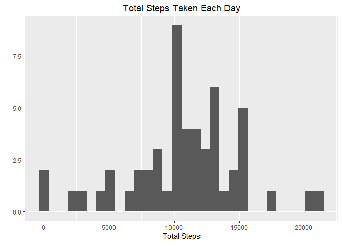
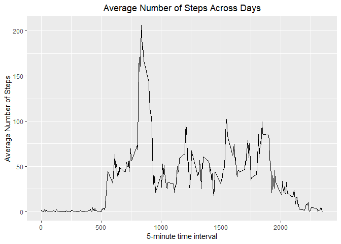
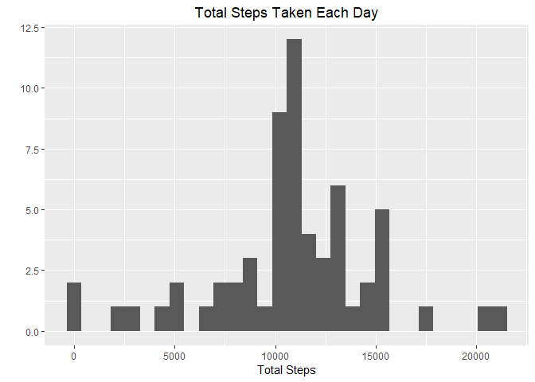
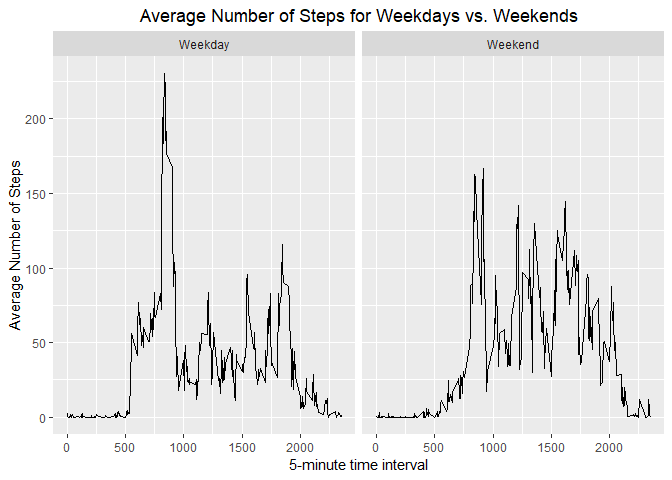

```r
    library(dplyr)
    library(ggplot2)
```

## Loading and preprocessing the data


```r
fileurl<-"https://d396qusza40orc.cloudfront.net/repdata%2Fdata%2Factivity.zip"
if (!file.exists("CP1data.zip")){
    download.file(fileurl,"CP1data.zip",method="curl")
    unzip("CP1data.zip")
}
act<-read.csv("activity.csv")
act$date<-as.Date(act$date, format="%Y-%m-%d")
str(act)
```

```
## 'data.frame':	17568 obs. of  3 variables:
##  $ steps   : int  NA NA NA NA NA NA NA NA NA NA ...
##  $ date    : Date, format: "2012-10-01" "2012-10-01" ...
##  $ interval: int  0 5 10 15 20 25 30 35 40 45 ...
```
With the data in the desired format now, it is necessary to get a quick idea of
the data using summary

```r
summary(act)
```

```
##      steps             date               interval     
##  Min.   :  0.00   Min.   :2012-10-01   Min.   :   0.0  
##  1st Qu.:  0.00   1st Qu.:2012-10-16   1st Qu.: 588.8  
##  Median :  0.00   Median :2012-10-31   Median :1177.5  
##  Mean   : 37.38   Mean   :2012-10-31   Mean   :1177.5  
##  3rd Qu.: 12.00   3rd Qu.:2012-11-15   3rd Qu.:1766.2  
##  Max.   :806.00   Max.   :2012-11-30   Max.   :2355.0  
##  NA's   :2304
```
This shows a good amount of missing data ~13% so to calculate the mean it is 
necessary to remove the NA values

## What is mean total number of steps taken per day?

```r
totalsteps<-act %>%
    group_by(date) %>%
    na.omit(steps) %>%
    summarise(totsteps=sum(steps))
    qplot(totalsteps$totsteps,
          main="Total Steps Taken Each Day",
          xlab="Total Steps")+
    theme(plot.title=element_text(hjust=.5))
```

<!-- -->

### Mean and median total steps taken each day

```r
    totalsteps%>%
    summarise(mean(totsteps),median(totsteps))
```

```
## # A tibble: 1 x 2
##   `mean(totsteps)` `median(totsteps)`
##              <dbl>              <int>
## 1           10766.              10765
```


## What is the average daily activity pattern?

```r
avgsteps <- act%>%
            group_by(interval)%>%
            summarise(mnstp=mean(steps,na.rm=TRUE))
ts1<-ggplot(avgsteps,aes(interval,mnstp))
ts1+geom_line()+
    labs(title="Average Number of Steps Across Days",
         y="Average Number of Steps",
         x="5-minute time interval")+
        theme(plot.title=element_text(hjust=.5))
```

<!-- -->

This means that the time interval that contains the maximum average steps is

```r
avgsteps[which(max(avgsteps$mnstp)==avgsteps$mnstp),1]
```

```
## # A tibble: 1 x 1
##   interval
##      <int>
## 1      835
```
## Imputing missing values

### Number of missing values

```r
sum(is.na(act))
```

```
## [1] 2304
```
To fill in the missing values I am going to use the mean steps across all days
for the corresponding 5 minute interval


```r
actimpute<-act%>%
    group_by(interval)%>%
    mutate(steps=ifelse(is.na(steps),mean(steps,na.rm=TRUE),steps))
```

### Histogram of imputed data set

```r
imputetotalsteps<-actimpute %>%
    group_by(date) %>%
    summarise(tsteps=sum(steps))
    qplot(imputetotalsteps$tsteps,
          main="Total Steps Taken Each Day",
          xlab="Total Steps")+
    theme(plot.title=element_text(hjust=.5))
```

<!-- -->

### Mean and Median of steps each day with imputed data set

```r
imputetotalsteps%>%
    summarise(mean(tsteps),median(tsteps))
```

```
## # A tibble: 1 x 2
##   `mean(tsteps)` `median(tsteps)`
##            <dbl>            <dbl>
## 1         10766.           10766.
```

The mean value for the imputed data set has not changed, however the median 
did change to the same value as the mean. As can be observed with the 
histogram, there is a spike in frequency of the total steps taken each day
in the center of the histogram for the imputed data set compared to the original.
Since the missing data comes from entire days, the missing days will all have the same 
imputed values. That is why there is a higher frequency of values observed in the
center of the histogram. The imputation adds 8 more observations which will have
the same total number of steps. The other days did not have missing data, so the
total steps for the other days will not be affected by the imputation.

## Are there differences in activity patterns between weekdays and weekends?


```r
actimpute<-actimpute%>%
    mutate(wkdy=ifelse(weekdays(date)=="Saturday" | weekdays(date)=="Sunday",
                        "Weekend","Weekday"))
actimpute$wkdy<-as.factor(actimpute$wkdy)
```


```r
avgimpsteps <- actimpute%>%
            group_by(interval,wkdy)%>%
            summarise(mnstp=mean(steps,na.rm=TRUE))
ts2<-ggplot(avgimpsteps,aes(interval,mnstp))
ts2+facet_wrap(.~wkdy)+
geom_line()+
    labs(title="Average Number of Steps for Weekdays vs. Weekends",
         y="Average Number of Steps",
         x="5-minute time interval")+
        theme(plot.title=element_text(hjust=.5))
```

<!-- -->
